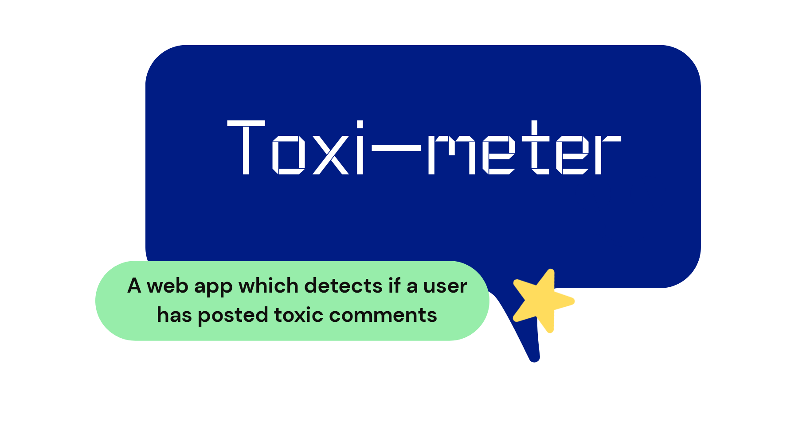

<h1 align="center">Toxi-meter</h1></br>

<p align="center">
:unamused: A web app which detects if a user on reddit has posted a toxic comment or not! :monocle_face:
</p>
<br>

<p align="center">
  <a href="#"></a>
  <a href="#"></a>
  <a href="https://github.com/k4u5h4L"></a>
  <a href="#"></a>
  <a href="#"></a>
</p>

<br>
<p align="center">
</img>
</p><br>

## Technologies used:

- React (create-react-app) for the front end.

- Python-Django for the backend server side.

- Urllib3 and BeautifulSoup for web scraping. Optionally selenium module included.

- Tensorflow 2.3.0 with the Keras syntax for the model training and predictions.

## To run:

- Clone and cd into the repo.

```
git clone https://github.com/k4u5h4L/Toxi-meter.git && cd Toxi-meter
```

- Cd into the client and install the required dependencies

```
cd client && npm install
```

- Install the dependencies from the `requirements.txt` file

```
cd ../server/ && pip install -r requirements.txt
```

- Run the Django server.

```
python manage.py runserver
```

- In another terminal, run the front end React client.

```
npm start
```

- Now visit the location [localhost:3000](http://localhost:3000) to visit the site.

## Note:

- This project is made as a hobby and is <b>NOT</b> a commercial application.

- Any contribution is welcome. You can fork and submit a pull request.

- The dataset is got from [kaggle](https://kaggle.com) from [this page](https://www.kaggle.com/fizzbuzz/cleaned-toxic-comments?select=train_preprocessed.csv) by [Zafar](https://www.kaggle.com/fizzbuzz).
  Please download the dataset and unzip the csv file in this file path `data/toxic-comments/train_preprocessed.csv` to train the model yourself.
